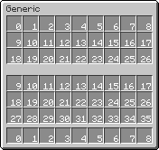
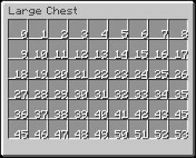

# Scripting

Wellblechhack provides a way of creating custom scripts using kotlin-scripting.
Use the in-game "Scripts" tab to create, run, and edit scripts.
The standard library provides a set of utility functions. All functions need to be prefixed with `lib.`.
You can also ```
with(lib) {
    // code here
} ``` to avoid prefixing everything with `lib`.
You can also access any object that is accessible from `MinecraftClient.getInstance()`. To do that, use `mc`.

## Available Functions

| Category             | Function                                                         | Description                                                                                                   | Example                                                                          |
|----------------------|------------------------------------------------------------------|---------------------------------------------------------------------------------------------------------------|----------------------------------------------------------------------------------|
| Logging              | `info(message: String)`                                          | Logs an informational message to the Minecraft client-side chat.                                              | `lib.info("Hello, World!")`                                                      |
|                      | `warn(message: String)`                                          | Logs a warning message to the Minecraft client-side chat.                                                     | `lib.warn("This is a warning!")`                                                 |
|                      | `error(message: String)`                                         | Logs an error message to the Minecraft client-side chat.                                                      | `lib.error("Something went wrong!")`                                             |
| Commands and Chat    | `command(command: String)`                                       | Executes a Minecraft command.                                                                                 | `lib.command("gamemode creative")`                                               |
|                      | `chat(message: String)`                                          | Sends a chat message.                                                                                         | `lib.chat("Hello, Minecraft!")`                                                  |
| Inventory Management | `isItemInSlot(slot: Int, item: String, where: String): Boolean`  | Checks if a specific item is in the given slot. The where parameter can be "inventory" or "container".        | `lib.isItemInSlot(0, "Diamond", "inventory")`                                    |
|                      | `getOpenContainer(): String`                                     | Returns the type of the currently open container.                                                             | `lib.info("Open container: ${lib.getOpenContainer()}")`                          |
|                      | `clickSlot(slot: Int, button: Int, where: String)`               | Clicks a slot in the specified location ("inventory" or "container").                                         | `lib.clickSlot(0, 0, "container")`                                               |
|                      | `moveItem(sourceSlot: Int, destinationSlot: Int, where: String)` | Moves an item from one slot to another in the specified location.                                             | `lib.moveItem(0, 1, "inventory")`                                                |
|                      | `dropStack(slot: Int, wholeStack: Boolean, where: String)`       | Drops the stack in the specified slot ("inventory" or "container").                                           | `lib.dropStack(0, true, "inventory")`                                            |
|                      | `getItems(where: String): List<ItemStack>`                       | Returns a list of items in the specified location ("inventory" or "container").                               | `lib.getItems("inventory").forEach { lib.info("Item: ${lib.getItemName(it)}") }` |
|                      | `getFirstSlotFromStack(stack: ItemStack, where: String): Int`    | Returns the first slot that contains a specific stack in the specified location ("inventory" or "container"). | `getFirstSlotFromStack(item, "inventory")`                                       |
| Item Data            | `getItemName(stack: ItemStack): String`                          | Returns the name of the item stack.                                                                           | `lib.info("Item name: ${lib.getItemName(stack)}")`                               |
|                      | `getItemCount(stack: ItemStack): Int`                            | Returns the count of items in the stack.                                                                      | `lib.info("Item count: ${lib.getItemCount(stack)}")`                             |
|                      | `getItem(slot: Int, where: String): ItemStack`                   | Returns the item in the specified slot ("inventory" or "container").                                          | `val item = lib.getItem(0, "inventory")`                                         |
|                      | `isSlotEmpty(slot: Int, where: String): Boolean`                 | Checks if a slot is empty in the specified location ("inventory" or "container").                             | `if (lib.isSlotEmpty(0, "inventory")) { lib.info("Slot is empty!") }`            |
| Utilities            | `delay(duration: Long)`                                          | Pauses the script for the specified duration (in milliseconds).                                               | `lib.delay(1000) (Pauses for 1 second)`                                          |

## Developing a plugin
Launch minecraft with the wellblechhack installed. Then, open the ClickGUI and click on the `Scripts` tab. There, you can create a new script and define a keybind for it.
Then, save it and click on the folder icon. This will open the associated application for `.js` files on your computer. You can now edit the script.
To run your script, either press the keybind or enter `.scripts run <name>` in the chat.

### Helping Images
These are images designed to display the slot IDs of the different containers.
<br>

<br>



### Note
Offhand, 2x2 crafting and armor slots can **only** be accessed while the inventory is open or no screen is open at all.
The following table shows all _special_ slots:

| Name       | Slot |
|------------|------|
| Offhand    | 45   |
| Helmet     | 36   |
| Chestplate | 37   |
| Leggings   | 38   |
| Boots      | 39   |

## Example Scripts

Swapping the first hotbar and offhand slot:
```kotlin
with(lib) {
    if (!isSlotEmpty(0, "inventory"))
        moveItem(0, 45, "inventory")
    else
        moveItem(45, 0, "inventory")
}
```

Dropping all items out of the inventory:
```kotlin
with(lib) {
    for (item in getItems("inventory")) {
        dropStack(getFirstSlotFromStack(item, "inventory"), true, "inventory")
    }
}
```

Sending a chat message using direct `mc` object:
```kotlin
mc.getNetworkHandler()?.sendChatMessage("Hello, World!")
```
